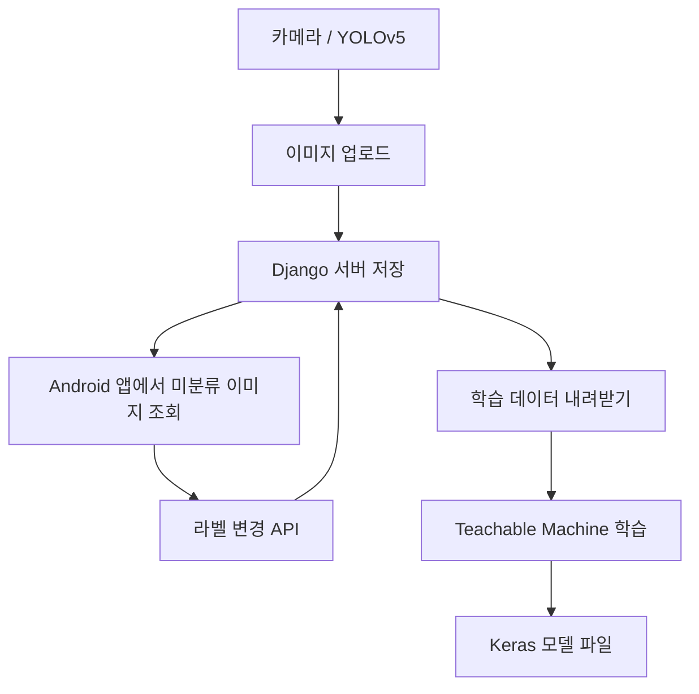
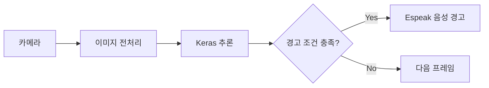

# Urination Detector

**카메라 이미지 수집, Django API, Android 라벨링 앱, Raspberry Pi 추론을 연결한 IoT 프로젝트**


**개인 프로젝트** · 조동휘: 앱·서버·수집 로직·추론 연동

[현장 시연](https://drive.google.com/file/d/1RpNKm9yhZ8sdQCA66H22pW5s6PCMZ65D/view) · [기능 테스트 영상](https://drive.google.com/file/d/1I0cp2PDVmjkZuUJ_DR5EsddChgGyegyf/view) · [구현 구조](#구현-구조) · [실행 조건](docs/SETUP.md)


## 프로젝트 개요

노상방뇨·흡연 행위를 분류하고 음성으로 경고하는 프로토타입입니다. 카메라에서 수집한 이미지를 서버에 저장하고, Android 앱에서 분류한 뒤 모델 학습과 엣지 추론으로 연결했습니다.

| 영역 | 구현 내용 |
| :--- | :--- |
| 수집 | YOLOv5 사람 감지 상태가 10초 이상 이어질 때 이미지 전송 |
| 서버·앱 | 이미지 저장 API, 미분류 이미지 조회, 라벨 변경 |
| 추론 | Keras 모델로 분류하고 조건 충족 시 Espeak 경고 출력 |

YOLOv5와 모델 학습 도구를 활용했으며, 직접 구현한 수집 조건·서버 API·앱·추론 연동을 중심으로 정리했습니다.

## 구현 구조

### 데이터 준비 흐름



### 현장 추론 흐름



데이터 준비와 현장 추론은 별도 단계입니다. 수집부터 모델 재학습까지 자동으로 수행하는 실시간 파이프라인은 아닙니다.

## 핵심 구현

### 01. 사람 감지 상태를 기준으로 이미지 수집

YOLOv5 결과에서 사람 감지 상태가 이어지는 시간을 확인하고, 10초 조건을 만족하면 이미지를 320×240으로 줄여 서버에 전송합니다. 동일 인물 추적이나 정지 자세 판별을 구현한 것은 아닙니다.

[수집 조건과 업로드](yolov5/changeDetection.py) · [탐지 루프 연결](yolov5/detect.py)

### 02. 앱과 서버를 연결하는 라벨링 API

서버는 이미지와 메타데이터를 저장하고, 앱은 미분류 이미지를 조회한 뒤 선택한 라벨을 전송합니다. Android 앱은 Java와 `HttpURLConnection`을 사용합니다.

| 값 | 의미 |
| :--- | :--- |
| `UCF` | 미분류 · 업로드 기본값 |
| `URN` | 노상방뇨 |
| `SMK` | 흡연 |
| `ETC` | 기타 |

[데이터 모델](djangogirls/blog/models.py) · [서버 API](djangogirls/blog/views.py) · [Android 앱](UrnationDetector/app/src/main/java/com/example/urnationdetector/MainActivity.java) · [API 상세](docs/API.md)

<details>
<summary>개발 당시 Android 라벨링 화면 보기</summary>


*기존 시연 자료입니다. 세로 화면은 원래 비율을 유지합니다.*

</details>

### 03. 분류 결과를 음성 경고로 연결

`keras_Model.h5`와 `labels.txt`를 읽어 카메라 프레임을 분류합니다. 예측 클래스가 노상방뇨 또는 흡연이고 신뢰도 점수가 **0.8을 초과**하면 해당 경고를 출력합니다.

0.8은 코드의 경고 임계값이며, 모델의 정확도 80%를 뜻하지 않습니다.

[전처리·추론·경고 코드](Urination_Detector/run.py)

## 실행과 검증

서버·Android 앱·카메라·학습 모델·음성 출력 환경이 필요합니다. [모듈별 실행 조건](docs/SETUP.md)과 [검증 기록](docs/VALIDATION.md)에서 현재 재현 가능한 범위를 확인할 수 있습니다.

## 현재 한계와 다음 개선

- 서버 주소와 인증 설정을 환경별로 분리하고, 각 클라이언트의 인증 헤더를 통일할 필요가 있습니다.
- 미분류 데이터가 없을 때의 응답과 조회 정렬 기준을 보강할 예정입니다.
- 네트워크 재시도, 경고 반복 간격, 오탐 측정이 필요합니다.
- 저장소만으로 야외 환경의 정확도·처리 속도를 재현했다고 주장하지 않습니다.

## 프로젝트 자료

| 자료 | 내용 |
| :--- | :--- |
| [연구 문서](https://drive.google.com/file/d/1f6kGLwl4XqyBqUO4NgoJRzLFDGW4-bWS/view) | 프로젝트 설계와 이론 |
| [기능 테스트 영상](https://drive.google.com/file/d/1I0cp2PDVmjkZuUJ_DR5EsddChgGyegyf/view) | 분류와 경고 동작 |
| [현장 설치 영상](https://drive.google.com/file/d/1RpNKm9yhZ8sdQCA66H22pW5s6PCMZ65D/view) | Raspberry Pi 현장 시연 |
| [발표 자료](https://docs.google.com/presentation/d/1J1sP0SbMh7VCPl-DiFDkMHlJIGEdiAfq/edit) | 전체 시스템 요약 |

<details>
<summary>프로젝트 구조</summary>

```text
yolov5/              사람 감지와 이미지 전송
djangogirls/         Django 서버와 이미지 API
UrnationDetector/    Android 라벨링 앱
LoadImage/           학습 데이터 내려받기
Urination_Detector/  Keras 추론과 음성 경고
```

`UrnationDetector`는 현재 Android 모듈의 실제 폴더 이름입니다.

</details>
